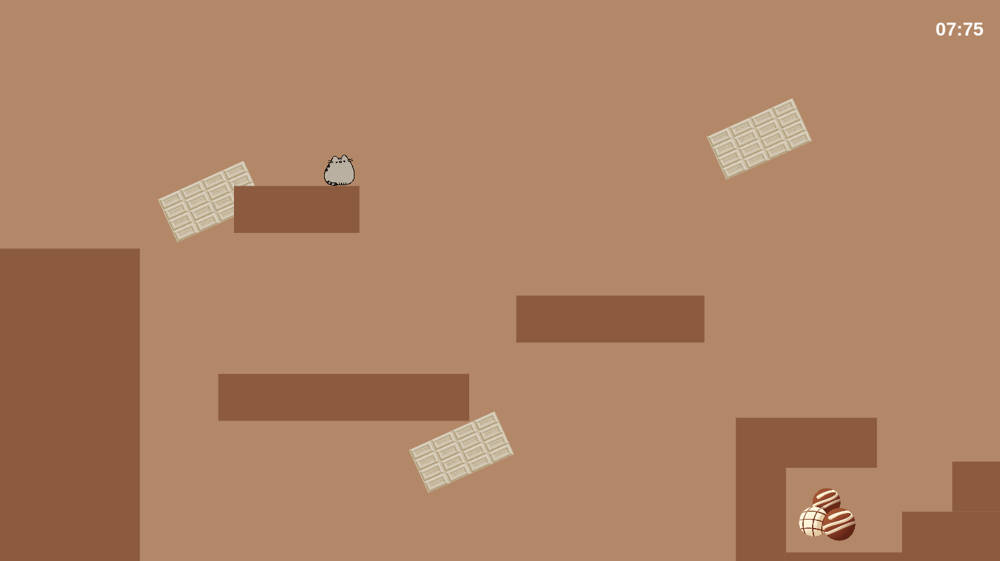
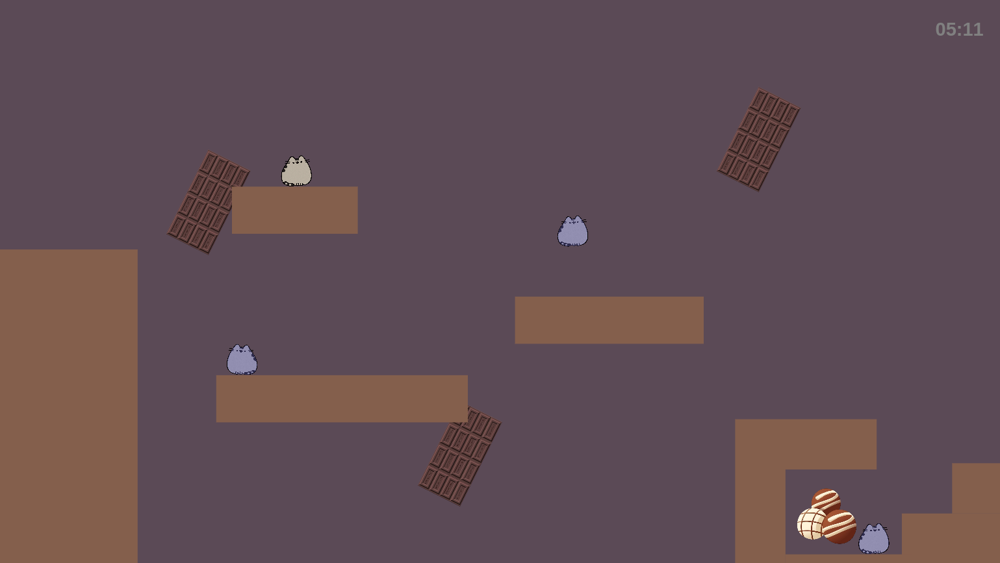

# 🍫 Chocolate 🐈

*Oyun Linki:* **[Chocolate](https://cigdem-yildiz.github.io/Chocolate/)** <br/>
*Bu proje, FreezedIce tarafından geliştirilen **[RetroRift](https://freezedice.itch.io/retrorift)** oyunundan ilham alınarak tasarlanmıştır.*

**Chocolate**, zamanı geri sarma mekaniklerine sahip web tabanlı bir 2D platform oyunudur. Küçük bir kedi olarak çikolatalı platformlarda zıplayarak bitiş noktasına ulaşın ve en büyük düşmanınızla, yani **kendi geçmişinizle** yüzleşin!

---

## 📸 Oyundan Görüntüler

<br/>
*Part 1: Zamana karşı yarışarak bitişe ulaşmaya çalışırken.*

<br/>
*Part 2: Kendi geçmiş hareketlerinizi taklit eden hayaletlerden kaçarken.*

---

## 🎯 Hedef ve Zorluk (Challenge)

**Hedef:** 
Kedi karakterinizi platformları aşarak verilen sürede bitiş noktasına ulaştırmak.

**Zorluk (Challenge):** 
Oyun birbirini tamamlayan iki döngüden oluşur. Bitiş noktasına ilk ulaştığınızda zaman donar. İkinci aşamada hedef aynıdır ancak bu sefer arkanızdan 1. aşamada izlediğiniz yolu birebir tekrar eden **hayaletler** gelir. Onlara çarpmadan veya boşluğa düşmeden bölümü tekrar bitirmelisiniz. Hayaletlere çarparsanız oyun tamamen başa döner!

---

## ⌨️ Kontroller

*   **[W]** veya **[YUKARI OK]** : Zıplama
*   **[A]** veya **[SOL OK]** : Sola Git
*   **[D]** veya **[SAĞ OK]** : Sağa Git

---

## 🛠️ Kullanılan Teknolojiler

Bu oyun, herhangi bir harici oyun motoru veya oyun kütüphanesi kullanılmadan sıfırdan yazılmıştır.
*   **HTML5** (Canvas API)
*   **JavaScript (ES6)** (Oyun döngüsü, fizik motoru, çarpışma algılama ve klon kayıt sistemi)
*   **CSS3** (Sayfa düzeni ve başlangıç ekranı)

---

## 📁 Proje Kurulumu ve Dosya Yapısı

Oyunu çalıştırmak için ekstra bir kuruluma gerek yoktur. Projeyi indirin ve `index.html` dosyasını modern bir web tarayıcısında açın.

```text
📁 Proje_Klasoru
│
├── 📄 index.html
├── 📁 images/
│   ├── acik_arka.jpeg
│   ├── bitis.png
│   ├── donen_acik.jpeg
│   ├── donen_koyu.jpeg
│   ├── giris_arka.jpeg
│   ├── hayalet_sol.png
│   ├── hayalet.png
│   ├── karakter_sol.png
│   ├── karakter.png
│   ├── koyu_arka.png
│   ├── part1.png
│   └── part2.png
│
└── 📁 audio_files/
    ├── arka.mp3
    ├── kaybetme.mp3
    ├── kazanma.mp3
    └── ziplama.mp3
    

```

## 👥 Geliştiriciler
[Hatice Sena Aşık](https://github.com/haticesenaasik) - Geliştirici & Tasarımcı

[Çiğdem Yıldız](https://github.com/Cigdem-Yildiz) - Geliştirici & Tasarımcı

## 📎 Kaynakça ve Assetler
Bu projede kullanılan ve ekibimize ait olmayan dış kaynaklı tüm materyaller aşağıda belirtilmiştir:

İlham Alınan Oyun: RetroRift by FreezedIce

Arka Plan Müziği: [Üretici](https://pixabay.com/users/freesound_community-46691455/) - [Link](https://pixabay.com/sound-effects/search/cute%20chiptune/)

Ses Efektleri: <br/>&emsp;Kazanma: [Üretici](https://pixabay.com/users/floraphonic-38928062/) - [Link](https://pixabay.com/sound-effects/search/you%20win%20sound/?pagi=4) 
<br/>&emsp;Zıplama: [Üretici](https://pixabay.com/users/sound_garage-47313534/) - [Link](https://pixabay.com/sound-effects/search/meow%20sound/)
<br/>&emsp;Kaybetme: [Üretici](https://pixabay.com/users/mori_sound-54904477/) - [Link](https://pixabay.com/sound-effects/search/lose%20game/)<br/>

Karakter ve Çevre Görselleri: <br/>&emsp;[Karakter](https://tr.pinterest.com/pin/1014717359799254051/)
                              <br/>&emsp;[Arka Plan Nesne 1](https://tr.pinterest.com/pin/719590846757094246/)
                              <br/>&emsp;[Arka Plan Nesne 1](https://tr.pinterest.com/pin/719590846757094234/)
                              <br/>&emsp;[Bitiş Nesnesi](https://tr.pinterest.com/pin/719590846757094023/)
                              <br/>&emsp;[Giriş Ekranı Arka Planı](https://tr.pinterest.com/pin/784541197626646918/)
